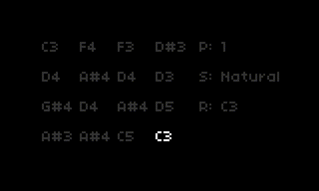

# Asp

A random MIDI snake sequencer for [Norns](https://monome.org/docs/norns/).



## About

Asp generates a set of 16 random notes and then triggers them via MIDI
through a sequence of patterns.

Asp does not generate music on its own. It is purely a MIDI sequencer.

## Options

Options can be set through the Norns setting screen.

### Scale

Changing either of these options will regenerate the sequence.

* Scale Mode: set the scale mode for the notes.
* Root Note: set the root note of the scale.

### Patterns

* Pattern: change the pattern of the sequencer. There are 16 defined patterns to choose from.

### MIDI

* Device: set the midi device to transmit the sequence out of.
* Channel: set the midi channel to transmit the sequence over.
* Velocity: set the velocity of the notes.

### Step

* Step Division: set the beat/measure division.
* Note Length: set the length of the note.

## Installation

```
;install https://github.com/jtopjian/asp
```

## Thanks

This Norns script was pulled together from reading some existing scripts:

* https://github.com/tehn/awake
* https://github.com/toneburst/bline
* https://github.com/keenanmcdonald/descartes
